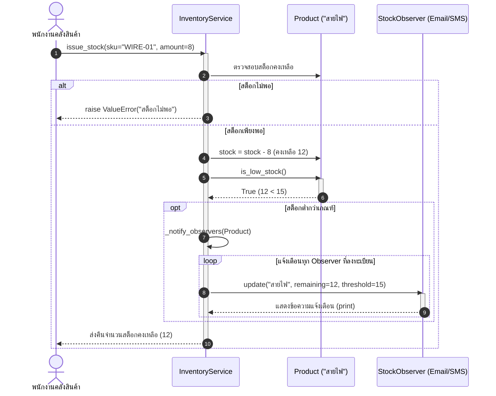

# Sequence Diagram: จ่ายสินค้าและแจ้งเตือนสต็อกต่ำ (US-02)

```mermaid
sequenceDiagram
    autonumber
    actor User as พนักงานคลังสินค้า
    participant Service as InventoryService
    participant Product as Product ("สายไฟ")
    participant Observer as StockObserver (Email/SMS)

    User->>Service: issue_stock(sku="WIRE-01", amount=8)
    activate Service
    
    Service->>Product: ตรวจสอบสต็อกคงเหลือ
    alt สต็อกไม่พอ
        Service-->>User: raise ValueError("สต็อกไม่พอ")
    else สต็อกเพียงพอ
        Service->>Product: stock = stock - 8 (คงเหลือ 12)
        Service->>Product: is_low_stock()
        activate Product
        Product-->>Service: True (12 < 15)
        deactivate Product
        
        opt สต็อกต่ำกว่าเกณฑ์
            Service->>Service: _notify_observers(Product)
            loop แจ้งเตือนทุก Observer ที่ลงทะเบียน
                Service->>Observer: update("สายไฟ", remaining=12, threshold=15)
                activate Observer
                Observer-->>Service: แสดงข้อความแจ้งเตือน (print)
                deactivate Observer
            end
        end
        
        Service-->>User: ส่งคืนจำนวนสต็อกคงเหลือ (12)
    end
    deactivate Service
```